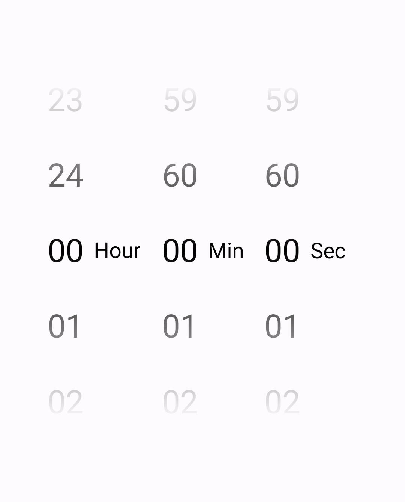

# Dial Picker
Dial Picker view.


## HOW TO USE

1. First declare the view in the xml file.
```    
<com.iulu.dialpicker.DialPicker
        android:id="@+id/dialSec"
        android:layout_width="wrap_content"
        android:layout_height="wrap_content"
        app:dialTextSize="30dp"
        app:descriptionTextSize="20dp"
        app:dialTextLeading="70dp"
        app:description="@string/dial_sec_description"
        app:descriptionStartPadding="10dp"
        app:gradientViewWindows=".9" />
```
   The full list of attribute can be found in ```attrs.xml``` file.

2. Load the list of elements to the dial.
``` 
 var myList = listOf("a", "b", "c", "d", "x")  // The number of elements needs to be at least 5.
 binding.dialSec.list = myList                 // These example uses View Binding.
 ```
> **_NOTE:_**
> By default the view will show a dial with 5 elements, from 01 to 05.

3. Register the ``` setOnSnapListener({ middleElement -> //called on snap }) ```
> **_NOTE:_**
> In ``` setOnSnapListener(listener: (element: String) -> Unit) ``` the ```element``` is the list element from the middle of the dial.
> If you want to retreve the list index of the element from the middle you can use the ```position``` property from the ```DialPicker``` class.

## [License](LICENSE)
    This Source Code Form is subject to the terms of the Mozilla Public
    License, v. 2.0. If a copy of the MPL was not distributed with this
    file, You can obtain one at https://mozilla.org/MPL/2.0/.
 
    copyright 2023, Purcel Iulian
